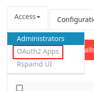
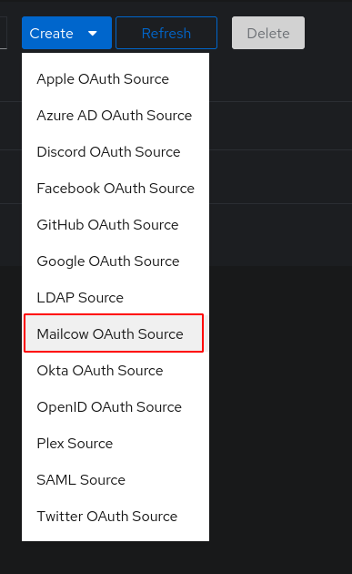

Support level: Community

Allows users to authenticate using their Mailcow credentials

## Preparation

The following placeholders will be used:

-   `authentik.company` is the FQDN of the authentik install.
-   `mailcow.company` is the FQDN of the mailcow install.

## Mailcow

1. Log into mailcow as an admin and navigate to the OAuth2 Apps settings

2. Click "Add OAuth2 Client"

3. Insert the redirect URL: `https://authentik.company/source/oauth/callback/mailcow/`

4. Copy the **Client ID** and **Client secret** and _save it for later_

## authentik

5. Under _Directory -> Federation & Social login_ Click **Create > Mailcow OAuth Source**

6. **Name:** Choose a name (For the example I used Mailcow)
7. **Slug:** mailcow (You can choose a different slug, if you do you will need to update the Mailcow redirect URL and point it to the correct slug.)
8. **Consumer Key:** Client ID from step 4
9. **Consumer Secret:** Client Secret from step 4
10. **Authorization URL:** https://mailcow.company/oauth/authorize
11. **Access token URL:** https://mailcow.company/oauth/token
12. **Profile URL:** https://mailcow.company/oauth/profile

Here is an example of a complete authentik Mailcow OAuth Source

Save, and you now have Mailcow as a source.

:::note
For more details on how-to have the new source display on the Login Page see [here](../index.md#add-sources-to-default-login-page).
:::
